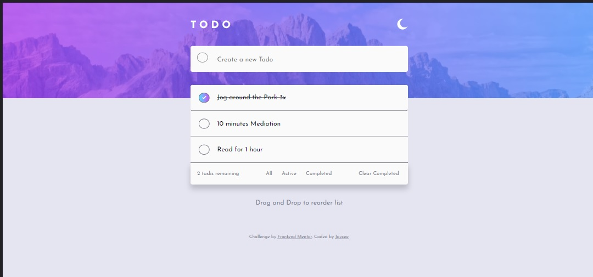

# Frontend Mentor - Todo app solution

This is a solution to the [Todo app challenge on Frontend Mentor](https://www.frontendmentor.io/challenges/todo-app-Su1_KokOW). Frontend Mentor challenges help you improve your coding skills by building realistic projects. 

## Table of contents

- [Overview](#overview)
  - [The challenge](#the-challenge)
  - [Screenshot](#screenshot)
  - [Links](#links)
- [My process](#my-process)
  - [Built with](#built-with)
  - [What I learned](#what-i-learned)
  - [Continued development](#continued-development)
  - [Useful resources](#useful-resources)
- [Author](#author)
- [Acknowledgments](#acknowledgments)

## Overview

### The challenge

Users should be able to:

- View the optimal layout for the app depending on their device's screen size
- See hover states for all interactive elements on the page
- Add new todos to the list
- Mark todos as complete
- Delete todos from the list
- Filter by all/active/complete todos
- Clear all completed todos
- Toggle light and dark mode
- **Bonus**: Drag and drop to reorder items on the list

### Screenshot

### Links

- Solution URL: [Github Solution](https://github.com/simplyJC/todo-app-main)
- Live Site URL: [Todo App live](https://pensive-varahamihira-45240f.netlify.app/)

## My process

### Built with

- Semantic HTML5 markup
- CSS custom properties
- Flexbox
- Mobile-first workflow
- Vanilla Javascript
- Sortable Jquery

### What I learned

This is the hardest challenge that I take in frontendmentor. I took me a long time to figure out how to code a Todo App in javascript with the help of some resources I found in the internet. Somehow I was able to make it. I know there are still a lot of modifications needed but this is by far the solution that I can do. 

### Continued development

I am still a beginner in Javascript. There is still a lot to learn. I am looking forward to take more Javascript challenges to further enhance my learning. 

### Useful resources

- [https://freshman.tech/todo-list/](https://freshman.tech/todo-list/) - This help me to better understand how adding and removing tasks. 
- [How to Code A Better To-Do List - Tutorial](https://www.youtube.com/watch?v=W7FaYfuwu70&t=1121s) - This is an amazing tutorial from WebDev which showing how you can save a tasks in local storage. This is somehow different but I just studied it and learn how things worked. 
- [Jquery Sortable](https://jqueryui.com/sortable/) - It will help you out in reordering tasks with a few javascript code. 

- [How To Create Dark Theme Switcher For Website Using CSS and JS](https://www.youtube.com/watch?v=D1yg4T37qYo) - One of the best tutorial in changing Theme.

- [Todo App FrontEndMentor by Quang Phan](https://www.frontendmentor.io/solutions/todo-app-Z3uvRFUqu)- I refer to this  Todo App on how he manage to reorder task. 

## Author

- Website - [SimplyJC](https://www.simplyjc.com)
- Frontend Mentor - [@simplyJC](https://www.frontendmentor.io/profile/simplyJC)
- Twitter - [@jcaltamia](https://twitter.com/jcaltamia)

